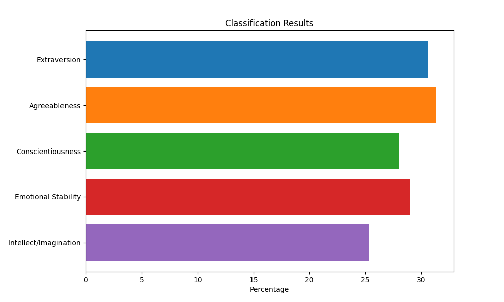

Based on your personality traits, here is some advice that may be helpful for you:

- As an extrovert, you likely thrive in social situations and enjoy being around others. Continue to seek out social interactions and build a strong network of friends and acquaintances. Join social clubs, participate in team activities, and reach out to others to maintain and grow your social connections. However, be mindful of your alone time and ensure you get sufficient rest and relaxation to avoid burnout.

- Your emotional stability score suggests that you are generally resilient and even-tempered. This is a strength, as it allows you to cope with stress and adversity effectively. However, be mindful of bottling up your emotions. Ensure that you have healthy outlets for expression, such as journaling, creative pursuits, or sharing your feelings with a trusted friend or therapist.

- Agreeableness is another prominent trait for you. Your warm and cooperative nature likely makes you well-liked and easy to get along with. Maintain this positive quality, but also be mindful of setting healthy boundaries and asserting your own needs and opinions when necessary. Practicing assertiveness can help ensure that your voice is heard and your needs are met while maintaining harmonious relationships.

- While you have a decent score in conscientiousness, focusing on organization and goal-setting could benefit you. Set clear, achievable goals and create a structured plan to work towards them. Break down larger tasks into smaller, manageable steps to avoid feeling overwhelmed. Also, try to incorporate healthy routines and habits into your daily life, such as regular exercise, healthy eating, and effective time management.

- Your intellect/imagination score suggests that you are open to new ideas and experiences. Embrace your curiosity and continue to explore different interests and pursuits. Engage in creative activities, learn new skills, and expose yourself to diverse cultures and perspectives to broaden your horizons. However, be mindful of becoming overly impulsive or losing focus. Set realistic goals and maintain a balance between exploring new ideas and seeing your current projects through to completion.

Remember, while these suggestions are based on your personality traits, you are not limited by them. Personal growth and change are always possible, and you can develop new habits and behaviors to enhance your life.
 

